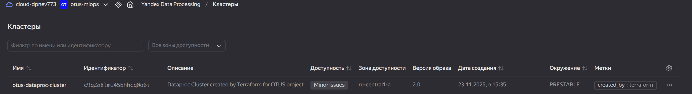
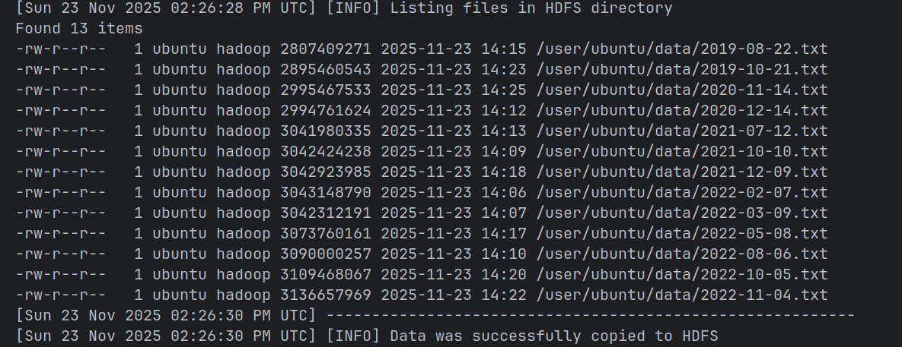
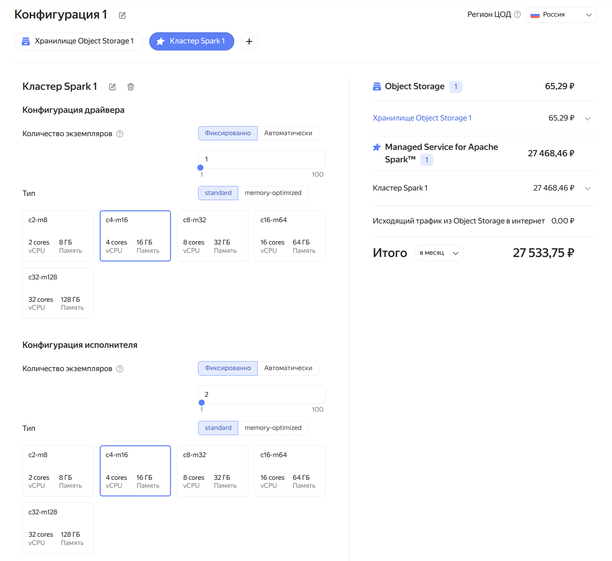

# Настройка облачной инфраструктуры для проекта по определению мошеннических транзакций

**Домашнее задание №2**  
**Курс MLOps**  
**Образовательная платформа «Otus»**

## Цель работы

В данном домашнем задании Вы познакомитесь с облачным провайдером Yandex Cloud, поработаете с сервисами Object Storage и Yandex Data Processing, создадите свой Spark-кластер и скопируете в него данные, научитесь оценивать затраты при проектировании облачной инфраструктуры.

## Описание проекта

> Наконец-то! Оформив трудоустройство и уладив все формальности с юристами компании, Вы можете приступить к работе. В первую очередь, Вас интересуют данные о транзакциях, которые были собраны за последние несколько лет. Пообщавшись с системным администратором, Вы узнаёте, что необходимая Вам информация расположена в озере данных компании в объектном хранилище, которое на время проведения работ по проекту будет Вам доступно по адресу:
>
> `s3://otus-mlops-source-data/`
>
> Поскольку данное хранилище предоставляется в режиме «только для чтения», то Вам потребуется перенести данные в другое, уже Ваше, хранилище для дальнейшей работы с ними, которое нужно будет предварительно создать. В качестве такого хранилища обычно используют либо S3-bucket, либо HDFS.
>
> Также, поскольку заказчик не имеет возможности предоставить собственную вычислительную инфраструктуру для выполнения проекта, для этой цели придется использовать облачные ресурсы. Поскольку данные для анализа расположены на серверах Yandex Cloud, то логично развернуть там и кластер для их обработки.

## Требования к инфраструктуре

### Промокод

Перед выполнением работы Вы можете запросить у менеджеров Otus промокод к Yandex Cloud, позволяющий работать с ресурсами облака в течение рамках данного курса.

### Кластер Yandex Data Processing

Spark-кластер должен иметь следующие характеристики:

- **Мастер-подкластер**: класс хоста `s3-c2-m8`, размер хранилища 40 ГБ
- **Data-подкластер**: класс хоста `s3-c4-m16`, 3 хоста, размер хранилища 128 ГБ  
  **Важное замечание:** Квоты на создание кластера в вашем аккаунте могут быть ограничены, поэтому если не удается создать кластер, нужно запросить у увеличение квот в поддержке Yandex Cloud.

## Задания

Решение будет ожидаться в виде репозитория/ветки на GitHub, с terraform конфигурациями и другим необходимым кодом для запуска всей системы.

### Обязательные задания

1. **Создать новый bucket в Yandex Cloud Object Storage** с использованием terraform скрипта. Примеры вы сможете найти в материалах занятия или на странице документации [Yandex Cloud](https://yandex.cloud/ru/docs/storage/tf-ref). Выложить созданный вами скрипт в GitHub репозиторий c заданием.

2. **Скопировать содержимое предоставленного хранилища** с использованием инструмента `s3cmd`. Для проверки преподавателем данный bucket необходимо сделать общедоступным, а точку доступа к нему привести в README-файле Вашего GitHub-репозитория.

3. **Создать Spark-кластер в Yandex Data Processing** с двумя подкластерами согласно указанным характеристикам. Для экономии ресурсов необходимо использовать terraform скрипт для создания и удаления кластера. Примеры вы сможете найти в материалах занятия или на странице документации [Yandex Cloud](https://yandex.cloud/ru/docs/data-proc/tf-ref). Выложить созданный вами скрипт в GitHub репозиторий c заданием.

4. **Соединиться по SSH с мастер-узлом** и выполнить на нём команду копирования содержимого хранилища в файловую систему HDFS с использованием инструмента `hadoop distcp`. Для проверки преподавателем необходимо вывести содержимое HDFS-директории в консоль, а снимок экрана с этой информацией привести в README-файле Вашего GitHub-репозитория.

5. **Оценить месячные затраты** используя тарифный калькулятор Yandex Cloud для поддержания работоспособности созданного кластера. Оценить, насколько использование HDFS-хранилища дороже, чем объектного.

### Дополнительные задания

6. **Предложить способы для оптимизации затрат** на содержание Spark-кластера в облаке и попробовать их реализовать.

7. **Изменить статус задач** на Kanban-доске в GitHub Projects в соответствии с достигнутыми результатами. Возможно, некоторые задачи нужно будет скорректировать, разделить на подзадачи или объединить друг с другом.

8. **Полностью удалить созданный кластер** с помощью команды `terraform destroy`, чтобы избежать оплаты ресурсов в период его простаивания.

## Важные замечания

### Тарификация кластера

Даже если кластер находится в выключенном состоянии, все равно облачный провайдер списывает денежные средства со счета клиента за резервирование части ресурсов. Это может привести к быстрому израсходованию денежных средств на счете!  
Не забывайте полностью удалить облачный кластер после завершения использования. Это удобно делать с помощью команд terraform.

### Мониторинг затрат

Кроме тарифного калькулятора, позволяющего делать оценку требуемых средств, на странице платежного аккаунта есть раздел с детализацией биллинга за произвольный период времени. С его помощью можно определить сумму уже потраченных средств на каждый из используемых облачных сервисов в процессе работы.

## Критерии оценки

Для получения положительной оценки за работу необходимо выполнить **задания 1-4 и 8** из вышеприведенного списка.

---

## **Выполнено:**

1. **Создан новый bucket `s3://otus-bucket-d96c6f8b8b8aa500/` в Yandex Cloud Object Storage** с использованием terraform скрипта
~~~console
yc storage bucket list --folder-id=b1gp9ivp5r63jjvecumi
+------------------------------+----------------------+----------+-----------------------+---------------------+
|             NAME             |      FOLDER ID       | MAX SIZE | DEFAULT STORAGE CLASS |     CREATED AT      |
+------------------------------+----------------------+----------+-----------------------+---------------------+
| otus-bucket-d96c6f8b8b8aa500 | b1gp9ivp5r63jjvecumi |        0 | ICE                   | 2025-11-23 12:35:37 |
+------------------------------+----------------------+----------+-----------------------+---------------------+
~~~

2. **Скопировано содержимое предоставленного хранилища** с использованием инструмента `s3cmd`.
~~~console
s3cmd ls s3://otus-bucket-d96c6f8b8b8aa500/
2025-11-23 13:03 2807409271   s3://otus-bucket-d96c6f8b8b8aa500/2019-08-22.txt
2025-11-23 13:04 2854479008   s3://otus-bucket-d96c6f8b8b8aa500/2019-09-21.txt
2025-11-23 13:05 2895460543   s3://otus-bucket-d96c6f8b8b8aa500/2019-10-21.txt
2025-11-23 13:07 2939120942   s3://otus-bucket-d96c6f8b8b8aa500/2019-11-20.txt
2025-11-23 13:08 2995462277   s3://otus-bucket-d96c6f8b8b8aa500/2019-12-20.txt
2025-11-23 13:10 2994906767   s3://otus-bucket-d96c6f8b8b8aa500/2020-01-19.txt
2025-11-23 13:11 2995431240   s3://otus-bucket-d96c6f8b8b8aa500/2020-02-18.txt
2025-11-23 13:12 2995176166   s3://otus-bucket-d96c6f8b8b8aa500/2020-03-19.txt
2025-11-23 13:14 2996034632   s3://otus-bucket-d96c6f8b8b8aa500/2020-04-18.txt
2025-11-23 13:15 2995666965   s3://otus-bucket-d96c6f8b8b8aa500/2020-05-18.txt
2025-11-23 13:17 2994699401   s3://otus-bucket-d96c6f8b8b8aa500/2020-06-17.txt
2025-11-23 13:18 2995810010   s3://otus-bucket-d96c6f8b8b8aa500/2020-07-17.txt
2025-11-23 13:19 2995995152   s3://otus-bucket-d96c6f8b8b8aa500/2020-08-16.txt
2025-11-23 13:21 2995778382   s3://otus-bucket-d96c6f8b8b8aa500/2020-09-15.txt
2025-11-23 13:22 2995868596   s3://otus-bucket-d96c6f8b8b8aa500/2020-10-15.txt
2025-11-23 13:23 2995467533   s3://otus-bucket-d96c6f8b8b8aa500/2020-11-14.txt
2025-11-23 13:25 2994761624   s3://otus-bucket-d96c6f8b8b8aa500/2020-12-14.txt
2025-11-23 13:26 2995390576   s3://otus-bucket-d96c6f8b8b8aa500/2021-01-13.txt
2025-11-23 13:28 2995780517   s3://otus-bucket-d96c6f8b8b8aa500/2021-02-12.txt
2025-11-23 13:29 2995191659   s3://otus-bucket-d96c6f8b8b8aa500/2021-03-14.txt
2025-11-23 13:30 2995446495   s3://otus-bucket-d96c6f8b8b8aa500/2021-04-13.txt
2025-11-23 13:32 3029170975   s3://otus-bucket-d96c6f8b8b8aa500/2021-05-13.txt
2025-11-23 13:33 3042691991   s3://otus-bucket-d96c6f8b8b8aa500/2021-06-12.txt
2025-11-23 13:35 3041980335   s3://otus-bucket-d96c6f8b8b8aa500/2021-07-12.txt
2025-11-23 13:36 3042662187   s3://otus-bucket-d96c6f8b8b8aa500/2021-08-11.txt
2025-11-23 13:37 3042455173   s3://otus-bucket-d96c6f8b8b8aa500/2021-09-10.txt
2025-11-23 13:39 3042424238   s3://otus-bucket-d96c6f8b8b8aa500/2021-10-10.txt
2025-11-23 13:40 3042358698   s3://otus-bucket-d96c6f8b8b8aa500/2021-11-09.txt
2025-11-23 13:42 3042923985   s3://otus-bucket-d96c6f8b8b8aa500/2021-12-09.txt
2025-11-23 13:43 3042868087   s3://otus-bucket-d96c6f8b8b8aa500/2022-01-08.txt
2025-11-23 13:45 3043148790   s3://otus-bucket-d96c6f8b8b8aa500/2022-02-07.txt
2025-11-23 13:46 3042312191   s3://otus-bucket-d96c6f8b8b8aa500/2022-03-09.txt
2025-11-23 13:48 3041973966   s3://otus-bucket-d96c6f8b8b8aa500/2022-04-08.txt
2025-11-23 13:49 3073760161   s3://otus-bucket-d96c6f8b8b8aa500/2022-05-08.txt
2025-11-23 13:50 3089378246   s3://otus-bucket-d96c6f8b8b8aa500/2022-06-07.txt
2025-11-23 13:52 3089589719   s3://otus-bucket-d96c6f8b8b8aa500/2022-07-07.txt
2025-11-23 13:53 3090000257   s3://otus-bucket-d96c6f8b8b8aa500/2022-08-06.txt
2025-11-23 13:55 3089390874   s3://otus-bucket-d96c6f8b8b8aa500/2022-09-05.txt
2025-11-23 13:56 3109468067   s3://otus-bucket-d96c6f8b8b8aa500/2022-10-05.txt
2025-11-23 13:58 3136657969   s3://otus-bucket-d96c6f8b8b8aa500/2022-11-04.tx
~~~

3. **Создан Spark-кластер в Yandex Data Processing** с двумя подкластерами согласно указанным характеристикам.

4. **Выполнено соединение по SSH с мастер-узлом** и выполнение на нём команды копирования содержимого хранилища в файловую систему HDFS с использованием инструмента `hadoop distcp`.

~~~console
[Sun 23 Nov 2025 02:26:28 PM UTC] [INFO] Listing files in HDFS directory
Found 13 items
-rw-r--r--   1 ubuntu hadoop 2807409271 2025-11-23 14:15 /user/ubuntu/data/2019-08-22.txt
-rw-r--r--   1 ubuntu hadoop 2895460543 2025-11-23 14:23 /user/ubuntu/data/2019-10-21.txt
-rw-r--r--   1 ubuntu hadoop 2995467533 2025-11-23 14:25 /user/ubuntu/data/2020-11-14.txt
-rw-r--r--   1 ubuntu hadoop 2994761624 2025-11-23 14:12 /user/ubuntu/data/2020-12-14.txt
-rw-r--r--   1 ubuntu hadoop 3041980335 2025-11-23 14:13 /user/ubuntu/data/2021-07-12.txt
-rw-r--r--   1 ubuntu hadoop 3042424238 2025-11-23 14:09 /user/ubuntu/data/2021-10-10.txt
-rw-r--r--   1 ubuntu hadoop 3042923985 2025-11-23 14:18 /user/ubuntu/data/2021-12-09.txt
-rw-r--r--   1 ubuntu hadoop 3043148790 2025-11-23 14:06 /user/ubuntu/data/2022-02-07.txt
-rw-r--r--   1 ubuntu hadoop 3042312191 2025-11-23 14:07 /user/ubuntu/data/2022-03-09.txt
-rw-r--r--   1 ubuntu hadoop 3073760161 2025-11-23 14:17 /user/ubuntu/data/2022-05-08.txt
-rw-r--r--   1 ubuntu hadoop 3090000257 2025-11-23 14:10 /user/ubuntu/data/2022-08-06.txt
-rw-r--r--   1 ubuntu hadoop 3109468067 2025-11-23 14:20 /user/ubuntu/data/2022-10-05.txt
-rw-r--r--   1 ubuntu hadoop 3136657969 2025-11-23 14:22 /user/ubuntu/data/2022-11-04.txt
[Sun 23 Nov 2025 02:26:30 PM UTC] ---------------------------------------------------------- 
[Sun 23 Nov 2025 02:26:30 PM UTC] [INFO] Data was successfully copied to HDFS
~~~

5. Оценить месячные затраты используя тарифный калькулятор Yandex Cloud для поддержания работоспособности созданного кластера.

> Оценить, насколько использование HDFS-хранилища дороже, чем объектного.

не нашел в калькуляторе оценку HDFS-хранилища

6. Полностью удалить созданный кластер с помощью команды terraform destroy, чтобы избежать оплаты ресурсов в период его простаивания.
~~~console
terraform state rm yandex_storage_bucket.data_bucket
terraform destroy --auto-approve
~~~

