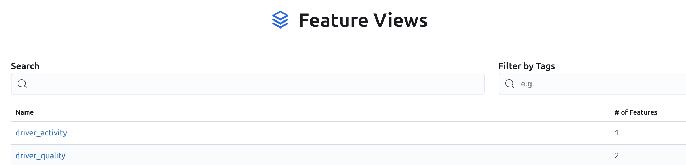

# **Лекция №21: Использование Feature Store: Feast**
> _MLOps_

## **Задание:**
Домашнее задание
Работаем с Feast

Цель:
Цель — получить опыт работы с Feast, попрактиковаться в создании Feature View.

Описание/Пошаговая инструкция выполнения домашнего задания:
Подробное описание домашнего задания можно найти по ссылке https://github.com/OtusTeam/MLOps/tree/main/hw_04

Критерии оценки:
Если выполнены 2 первых пункта — задание засчитано.
Ноутбук приложен.

---

## **Выполнено:**

1. Созданы 2 новые Feature View 

2. Создана 1 on-demand Feature View для вычисления признаков в реальном времени

3. Ноутбук, в котором делается запрос к этим Feature View
[otus-feature-store/hw04.ipynb](https://github.com/Deron-D/otus-feature-store/blob/hw04/hw04.ipynb)

---
### Полезное

  
Дополнительная информация

### Ссылки
https://github.com/NickOsipov/otus-feature-store

